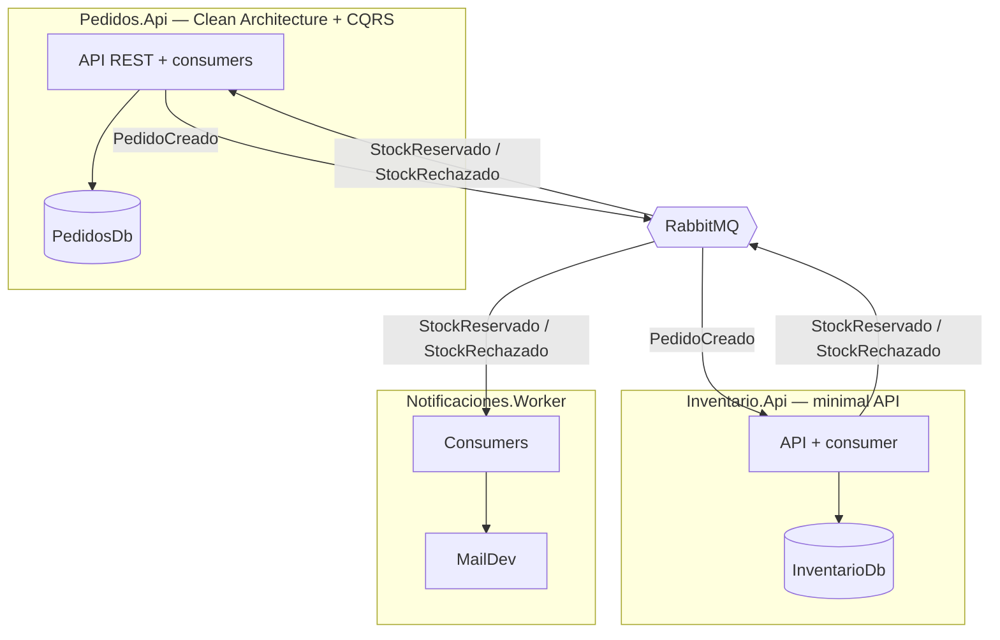

# Demo de microservicios en .NET 10


Un sistema de pedidos con tres microservicios que se comunican por eventos. 
.NET moderno, mensajería asíncrona con RabbitMQ, outbox/inbox transaccional, logging estructurado y todo orquestado con Docker Compose.

Es un proyecto de aprendizaje deliberado, y por eso las decisiones de arquitectura están documentadas más abajo. Incluidas las que descarté y por qué.

## Arquitectura



**El flujo completo:** crear un pedido lo guarda en estado *Pendiente* y publica `PedidoCreado`. Inventario consume el evento, intenta reservar el stock y responde con `StockReservado` o `StockRechazado` (con el motivo). Pedidos consume la respuesta y confirma o cancela el pedido; Notificaciones consume los mismos eventos (fan-out) y envía el email correspondiente. Ningún servicio llama a otro por HTTP: la conversación es enteramente por hechos publicados en el bus.

## Ejecutar

Solo necesitas Docker:

```
docker compose up -d --build
```

| Qué | Dónde |
|---|---|
| Swagger de Pedidos | http://localhost:5001/swagger |
| Swagger de Inventario | http://localhost:5002/swagger |
| RabbitMQ Management | http://localhost:15672 (admin / Demo_Password123!) |
| Bandeja de emails (MailDev) | http://localhost:1080 |

Las credenciales del repositorio son deliberadamente de desarrollo local.

## Escenarios de demo

1. **Camino feliz.** `POST /pedidos` con el producto `33333333-3333-3333-3333-333333333333` → en un par de segundos el pedido pasa a *Confirmado* él solo (compruébalo con el GET) y llega un email a MailDev. Nadie tuvo que llamar al endpoint de confirmación: el pedido se confirmó automáticamente al procesar el mensaje.
2. **Sin stock.** El mismo POST con el producto `55555555-5555-5555-5555-555555555555` (creado con stock cero) → el pedido acaba *Cancelado* y el email de cancelación incluye el motivo que redactó Inventario.
3. **Tolerancia a fallos.** `docker compose stop rabbitmq`, crea un pedido: responde **201** con el broker caído. El evento espera en la tabla `OutboxMessage` de PedidosDb (míralo con un SELECT). `docker compose start rabbitmq` y el sistema se recupera solo: reserva, confirmación y email, sin perder nada.
4. **Trazabilidad.** Copia el id de cualquier pedido y ejecuta `docker compose logs --since 5m | grep <id>` (o `findstr` en Windows): la vida completa del pedido cruzando los tres servicios, en orden, en una sola búsqueda.

## Decisiones de arquitectura

**Clean Architecture solo donde se justifica.** Pedidos tiene las capas (Domain / Application / Infrastructure / Api) porque concentra las reglas de negocio; Inventario es una minimal API plana a propósito, porque una tabla de contadores no necesita agregados ni factorías; Notificaciones es un worker sin HTTP porque nadie le pregunta nada. No todos los servicios tienen las mismas necesidades, por eso no utilicé la misma arquitectura en todos. Elegí la más adecuada para cada uno, y las diferencias entre ellos son una decisión deliberada.

**CQRS sin MediatR.** Los commands y queries usan interfaces propias (`ICommandHandler<,>`, `IQueryHandler<,>`): unas 30 líneas con el DI nativo de .NET. CQRS es un patrón, no un paquete NuGet, y para este tamaño la dependencia no aportaba nada (además de que MediatR pasó a licencia comercial). El camino de lectura ni siquiera pasa por el dominio: proyecta directo a DTO con EF y `AsNoTracking`, calculando los agregados en SQL.

**La lógica vive en las entidades.** `Pedido` se construye por factoría estática con constructor privado (no puede existir en estado inválido), expone sus líneas como colección de solo lectura y protege sus transiciones de estado con guardas que lanzan excepciones de dominio. Los handlers orquestan; no deciden. El modelo anémico —propiedades públicas y lógica desperdigada por servicios— es exactamente lo que quería evitar en el servicio con dominio de verdad.

**Base de datos por servicio.** `PedidosDb` e `InventarioDb` son bases de datos separadas y ningún servicio toca los datos de otro. Comparten instancia física de SQL Server porque el aislamiento que importa es de datos y esquema; separar instancias es una decisión de operaciones y coste, no de arquitectura.

**Eventos con payload mínimo y contratos compartidos a sabiendas.** `PedidoCreado` lleva las líneas sin precios (a Inventario no le incumben); las respuestas llevan solo el `PedidoId` y, en el rechazo, el motivo. Los contratos viven en una librería compartida: es un acoplamiento consciente, razonable para una solución de un solo equipo. En un sistema con equipos separados cada servicio duplicaría los contratos que consume y habría que versionar los eventos.

**Outbox e inbox transaccionales.** Publicar un evento es escribir en una tabla de la misma base de datos, dentro de la misma transacción que los datos de negocio; un proceso de MassTransit lo entrega al broker con reintentos. Eso elimina el estado "pedido guardado, evento perdido" y convierte al broker en infraestructura que puede caerse sin romper nada (escenario 3 de la demo). En el lado consumidor, el inbox registra cada `MessageId` procesado y descarta duplicados: RabbitMQ entrega al menos una vez, y la idempotencia la resuelve el sobre, no la lógica de negocio.

**Versiones elegidas con motivo.** .NET 10 por ser el LTS vigente (la 9 es STS y salió de soporte en mayo de 2026). MassTransit fijado a 8.x porque la v9 pasó a licencia comercial; la rama 8 sigue siendo open source y mantenida. `SmtpClient` para hablar con MailDev en local, sabiendo que para producción la recomendación es MailKit.

**Tests unitarios con fakes en las fronteras.** El dominio se testea sin mocks (si una entidad necesita mocks, el diseño cojea) y los handlers con fakes en memoria del repositorio y del publicador. Por eso el CI compila y pasa los tests en una máquina limpia sin SQL Server, sin RabbitMQ y sin Docker.

## Deudas conocidas y siguientes pasos

Las conozco y están pospuestas: tests de integración con Testcontainers (`WebApplicationFactory` + SQL Server efímero), healthchecks en Compose con `condition: service_healthy`, OpenTelemetry + Seq para trazas con interfaz de consulta (la correlación por `PedidoId` es la versión artesanal de eso), optimización de capas en los Dockerfiles (restore cacheado) y autenticación en las APIs.

## Stack

.NET 10 · C# · ASP.NET Core minimal APIs · EF Core · SQL Server · MassTransit 8 · RabbitMQ · Serilog · Docker Compose · xUnit
