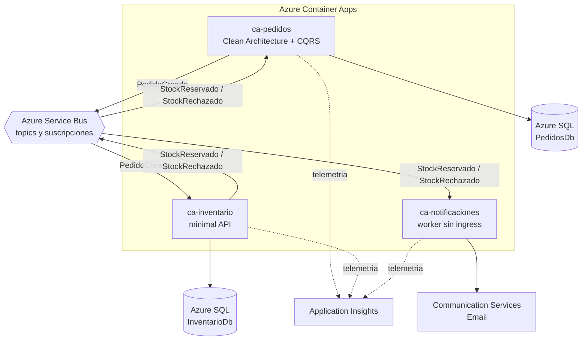
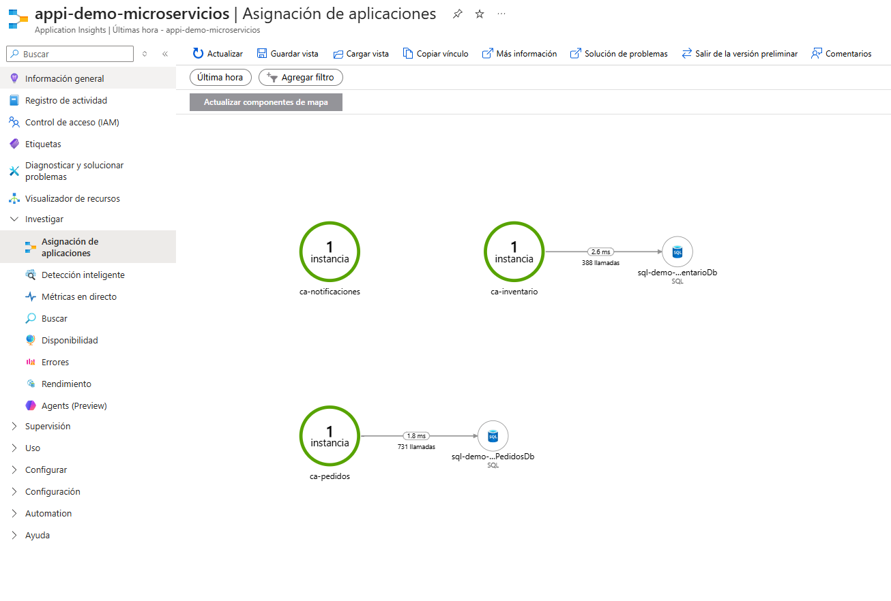
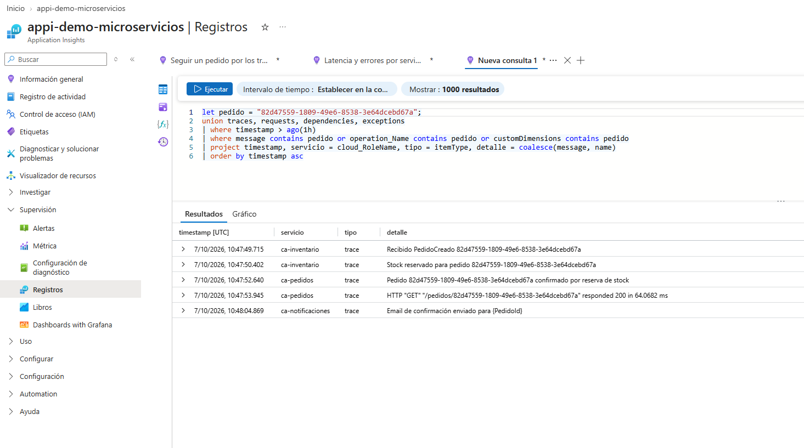

# Demo de microservicios en .NET 10, desplegado en Azure

[](https://github.com/AngelLopezGil/demo-microservicios/actions/workflows/ci.yml)
[](https://github.com/AngelLopezGil/demo-microservicios/actions/workflows/desplegar-azure.yml)

Un sistema de pedidos con tres microservicios que se comunican por eventos, corriendo en Azure sobre servicios gestionados.

Esta rama es la versión en la nube. La rama `main` conserva la versión local ejecutable con `docker compose up`, que no necesita cuenta de Azure ni credenciales. Las dos existen a propósito: comparar el diff entre ramas enseña exactamente qué cambió al migrar, y es menos de lo que la gente espera.

Es un proyecto de aprendizaje deliberado. Las decisiones están documentadas más abajo, incluidas las que descarté y por qué.

## Arquitectura


```mermaid
flowchart TB
    subgraph ACA["Azure Container Apps"]
        PA["ca-pedidos<br/>Clean Architecture + CQRS"]
        IA["ca-inventario<br/>minimal API"]
        NW["ca-notificaciones<br/>worker sin ingress"]
    end

    SB{{"Azure Service Bus<br/>topics y suscripciones"}}
    PDB[("Azure SQL<br/>PedidosDb")]
    IDB[("Azure SQL<br/>InventarioDb")]
    ACS["Communication Services<br/>Email"]
    AI["Application Insights"]

    PA --> PDB
    IA --> IDB
    PA -- PedidoCreado --> SB
    SB -- PedidoCreado --> IA
    IA -- StockReservado / StockRechazado --> SB
    SB -- StockReservado / StockRechazado --> PA
    SB -- StockReservado / StockRechazado --> NW
    NW --> ACS
    PA -.telemetria.-> AI
    IA -.telemetria.-> AI
    NW -.telemetria.-> AI
```

**El flujo:** crear un pedido lo guarda en estado *Pendiente* y publica `PedidoCreado`. Inventario consume el evento, intenta reservar el stock y responde con `StockReservado` o `StockRechazado` con el motivo. Pedidos consume la respuesta y confirma o cancela el pedido. Notificaciones consume los mismos eventos por fan-out y envía el correo. Ningún servicio llama a otro por HTTP: la conversación es enteramente por hechos publicados en el bus.



El mapa de arriba no lo dibujé yo. Lo reconstruye Application Insights a partir de la telemetría, siguiendo el contexto de traza que viaja dentro de cada mensaje a través del broker.

## Cómo levantarlo

El entorno de Azure se crea desde cero con el script de aprovisionamiento:

```powershell
.\crear-infraestructura.ps1 -Sufijo tu-sufijo -RemitenteEmail "..." -DestinatarioEmail "..."
```

Y se destruye entero con un comando:

```powershell
az group delete --name rg-demo-microservicios --yes
```

El script tiene dos pasos manuales documentados en su cabecera y una limitación conocida que no he podido verificar. Está en `crear-infraestructura.ps1`.

A partir de ahí, cualquier commit en esta rama despliega solo: el workflow ejecuta los tests, construye las tres imágenes etiquetadas con el hash del commit, las sube al registro y actualiza los tres servicios.

**Para probarlo en local sin cuenta de Azure**, usa la rama `main`: `docker compose up -d --build` y tienes el sistema entero con RabbitMQ y una bandeja de correo falsa.

## Escenarios de demo

1. **Camino feliz.** `POST /pedidos` con el producto `33333333-3333-3333-3333-333333333333`. En un par de segundos el pedido pasa a *Confirmado* él solo y llega un correo real. Nadie llamó a ningún endpoint de confirmación: se confirmó al procesar el mensaje de vuelta.
2. **Sin stock.** El mismo POST con el producto `55555555-5555-5555-5555-555555555555`, creado con stock cero. El pedido acaba *Cancelado* y el correo incluye el motivo que redactó Inventario.
3. **Tolerancia a fallos.** Con el broker inalcanzable, crear un pedido sigue devolviendo **201**. El evento espera en la tabla `OutboxMessage` y se entrega solo al restaurarse la conexión, completando la saga sin perder nada.
4. **Trazabilidad.** Copia el id de un pedido y ejecútalo en la consulta KQL guardada: su vida completa cruzando los tres servicios y el broker, en orden, en una sola búsqueda.



El escenario 3 cambió al migrar y el cambio es interesante. En local se demostraba apagando RabbitMQ con `docker compose stop`. Con un servicio gestionado eso no existe: el broker no es mío y no puedo pararlo. La prueba equivalente ataca la conectividad del cliente, añadiendo al contenedor una entrada de `/etc/hosts` que resuelve el namespace a su propio localhost. Mismo efecto observable, causa distinta, y es una consecuencia general de migrar a PaaS que conviene tener presente.

## Decisiones de infraestructura

| Necesidad | Elegido | Descartado | Por qué |
|---|---|---|---|
| Ejecutar contenedores | Container Apps | AKS | Kubernetes gestionado tiene coste fijo alto y una curva que este sistema no justifica. Container Apps da escalado, ingress con HTTPS y revisiones sin administrar un clúster. |
| Ejecutar contenedores | Container Apps | App Service | Desplegué primero en App Service y funciona, pero obliga a un artefacto por aplicación y no encaja con tres servicios que ya estaban en contenedores. |
| Mensajería | Service Bus Standard | Service Bus Basic | Basic solo ofrece colas. El fan-out necesita topics con suscripciones. |
| Mensajería | Service Bus Standard | RabbitMQ en contenedor | Se podía, incluso con escalado a cero vía KEDA. Pero el broker tiene que estar siempre despierto para que haya algo que medir, con volumen persistente e ingreso TCP, por un precio equivalente al del servicio gestionado y para borrarlo después. |
| Base de datos | Azure SQL Basic | Serverless con pausa automática | El delivery service del outbox y la limpieza del inbox consultan la base cada pocos segundos. Nunca se pausaría, y el serverless sin pausa es mucho más caro. |
| Base de datos | Azure SQL Basic | Oferta gratuita de Azure SQL | No está disponible en Spain Central, y aceptarla habría atado todas las bases gratuitas futuras de la suscripción a otra región. |
| Credenciales | Identidad administrada | Key Vault | Si la identidad administrada funciona, no quedan secretos que guardar. Un almacén vacío no aporta seguridad. |
| Correo | SDK de Communication Services | Relé SMTP de Communication Services | El SMTP habría permitido no tocar el código, pero su configuración falla en vista previa y, sobre todo, no admite identidades administradas. |
| Observabilidad | OpenTelemetry con exportador a Azure | SDK clásico de Application Insights | OpenTelemetry es un estándar abierto. La instrumentación no queda atada a Azure: el mismo código exporta a otro destino cambiando el exportador. |
| CI/CD | OIDC federado | Secreto de entidad de servicio | GitHub firma un token que dice desde qué repositorio y rama viene. Azure lo verifica. No hay contraseña almacenada que rotar ni que filtrar. |

## Seguridad

El sistema no tiene credenciales. No es que estén bien guardadas: no existen.

Los tres servicios autentican contra Azure SQL, Service Bus, Communication Services y el registro de contenedores con identidad administrada. Las claves compartidas están deshabilitadas en Service Bus, y el servidor SQL solo admite autenticación de Entra, así que ni siquiera el administrador tiene contraseña. Cada identidad tiene roles acotados al recurso que usa.

El detalle, las pruebas comprobables y las tres deudas que quedan abiertas están en [docs/seguridad-sin-credenciales.md](docs/seguridad-sin-credenciales.md).

## Coste

Precios de lista, región Spain Central:

| Servicio | Tier | Aproximado al mes |
|---|---|---|
| Azure SQL Database (dos bases) | Basic | 9 USD |
| Service Bus | Standard | 10 USD |
| Container Registry | Basic | 5 USD |
| Container Apps | Consumo, tres réplicas mínimas | 16 USD |
| Application Insights | 5 GB gratis al mes | 0 |
| Communication Services Email | Por mensaje | céntimos |

El consumo medido fue menor que la suma, porque el regalo mensual gratuito de Container Apps absorbe una parte y las tres réplicas se facturan siempre en tarifa de reposo. Eso último lo comprobé en los medidores de facturación, no lo supuse: el sondeo del outbox queda por debajo de los umbrales de actividad.

**Lo que recortaría primero si me pidieran bajar el coste:** el Container Registry, que cuesta más que los tres servicios juntos por guardar tres imágenes. Después, consolidar las dos bases en una, aunque eso rompería el aislamiento de datos por servicio y sería una decisión de coste a costa de arquitectura.

## Decisiones de aplicación

Estas no cambiaron al migrar. El código de negocio es el mismo en las dos ramas.

**Clean Architecture solo donde se justifica.** Pedidos tiene las capas (Domain, Application, Infrastructure, Api) porque concentra las reglas de negocio. Inventario es una minimal API plana a propósito, porque una tabla de contadores no necesita agregados ni factorías. Notificaciones es un worker sin HTTP porque nadie le pregunta nada. No todos los servicios tienen las mismas necesidades, y las diferencias entre ellos son deliberadas.

Esa decisión tuvo una consecuencia tardía que no anticipé. El Dockerfile de Notificaciones usa la imagen base `runtime` en vez de `aspnet`, correctamente, porque no sirve HTTP. Meses después, al instrumentar con OpenTelemetry, el paquete recomendado resultó depender del framework compartido de ASP.NET, que no está en esa imagen. Hubo que montar el exportador a mano. Una decisión de arquitectura acertada puede costarte trabajo mucho más adelante, en un sitio que no tiene nada que ver.

**CQRS sin MediatR.** Los commands y queries usan interfaces propias: unas 30 líneas con el contenedor nativo de .NET. CQRS es un patrón, no un paquete NuGet, y para este tamaño la dependencia no aportaba nada. El camino de lectura ni siquiera pasa por el dominio: proyecta directo a DTO con EF Core y `AsNoTracking`.

**La lógica vive en las entidades.** `Pedido` se construye por factoría estática con constructor privado, expone sus líneas como colección de solo lectura y protege sus transiciones de estado con guardas que lanzan excepciones de dominio. Los handlers orquestan, no deciden.

**Base de datos por servicio.** `PedidosDb` e `InventarioDb` están separadas y ningún servicio toca los datos de otro. Comparten servidor lógico porque el aislamiento que importa es de datos y esquema.

**Eventos con payload mínimo y contratos compartidos a sabiendas.** `PedidoCreado` lleva las líneas sin precios, porque a Inventario no le incumben. Los contratos viven en una librería compartida: es un acoplamiento consciente, razonable para una solución de un solo equipo.

**Outbox e inbox transaccionales.** Publicar un evento es escribir en una tabla de la misma base de datos, dentro de la misma transacción que los datos de negocio. Eso elimina el estado "pedido guardado, evento perdido". En el lado consumidor, el inbox registra cada `MessageId` procesado y descarta duplicados.

Al migrar comprobé algo que no era obvio: **el outbox no depende del transporte**. Cortar RabbitMQ y cortar Service Bus producen exactamente el mismo comportamiento observable, porque publicar es escribir en mi base de datos y el broker solo interviene después, en la entrega.

**Tests unitarios con fakes en las fronteras.** El dominio se testea sin mocks, y los handlers con fakes en memoria del repositorio y del publicador. Por eso los 13 tests pasaron sin tocarse al cambiar de broker: nunca supieron cuál había detrás.

## Qué cambió al migrar, y qué no

El cambio de RabbitMQ a Service Bus fue un paquete NuGet y tres bloques de cinco líneas. Ni un consumer, ni un handler, ni el dominio, ni el outbox, ni un solo test.

La frase que lo resume: mi código de aplicación no conoce el broker, conoce el bus. La inversión de dependencias que ya aplicaba dentro del proyecto resulta que MassTransit la aplica también en la frontera del transporte.

Lo que sí es distinto, y lo que me sorprendió de cada cosa, está en [docs/comparativa-rabbitmq-servicebus.md](docs/comparativa-rabbitmq-servicebus.md).

## Deudas conocidas

Las de la versión local siguen abiertas: tests de integración con Testcontainers, healthchecks en Compose, optimización de capas en los Dockerfiles y autenticación en las APIs.

Las que añadió la migración:

- **No hay política de reintentos en MassTransit.** A la primera excepción el mensaje va a la cola de error. Un timeout de SQL mandaría ahí un mensaje perfectamente procesable.
- **La saga se queda colgada si un consumidor falla.** No hay timeout ni compensación. Es el precio de la coreografía frente a la orquestación, y el caso donde un orquestador con estado aportaría algo real.
- **El rol de Communication Services es más amplio del necesario.** Microsoft no documenta con claridad el conjunto mínimo de permisos para enviar correo.
- **El firewall de SQL permite conexiones desde cualquier recurso de Azure.** La solución correcta serían endpoints privados.
- **Las aplicaciones corren con `ASPNETCORE_ENVIRONMENT=Development`**, lo que expone trazas de excepción en una URL pública. Lo mantengo para que se vea Swagger en la demo.
- **El aprovisionamiento es imperativo, no declarativo.** El script encadena comandos de la CLI. El siguiente paso sería reescribirlo en Bicep.
- **Un solo namespace de Service Bus para local y nube**, lo que convierte los dos entornos en consumidores que compiten por la misma cola si levanto el Compose mientras Azure corre.

## Stack

.NET 10, C#, ASP.NET Core minimal APIs, EF Core, MassTransit 8, xUnit, Serilog, OpenTelemetry, Docker.

Azure Container Apps, Azure Service Bus, Azure SQL Database, Azure Container Registry, Communication Services, Application Insights, Microsoft Entra ID, GitHub Actions.
