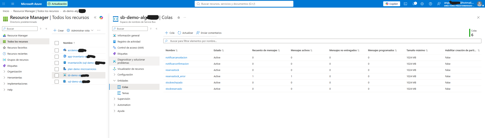

# De RabbitMQ a Azure Service Bus

Notas de la migración del transporte de mensajería de este sistema, desde RabbitMQ en contenedor a Azure Service Bus gestionado. Escritas mientras la hacía, no después.

El objetivo de este documento es responder tres preguntas: qué cambió, qué no cambió, y qué no es equivalente entre los dos brokers aunque lo parezca.

---

## El cambio, en números

| | Antes | Después |
|---|---|---|
| Broker | RabbitMQ 3 en contenedor local | Azure Service Bus Standard, región Spain Central |
| Paquete NuGet | `MassTransit.RabbitMQ` 8.5.10 | `MassTransit.Azure.ServiceBus.Core` 8.5.10 |
| Configuración | `UsingRabbitMq(...)` con host, vhost, usuario y contraseña | `UsingAzureServiceBus(...)` con cadena de conexión |
| Contenedores en Compose | 6 | 5 |
| Líneas de lógica de negocio modificadas | — | 0 |
| Tests modificados | — | 0 (13 en verde antes y después) |

El cambio real son tres bloques de cinco líneas, uno por servicio, más el paquete.

## Qué cambió exactamente

Antes:

```csharp
x.UsingRabbitMq((contexto, cfg) =>
{
    cfg.Host(builder.Configuration["Rabbit:Host"] ?? "localhost", "/", h =>
    {
        h.Username(builder.Configuration["Rabbit:Usuario"] ?? "admin");
        h.Password(builder.Configuration["Rabbit:Password"] ?? "Demo_Password123!");
    });
    cfg.ConfigureEndpoints(contexto);
});
```

Después:

```csharp
x.UsingAzureServiceBus((contexto, cfg) =>
{
    cfg.Host(builder.Configuration.GetConnectionString("ServiceBus"));
    cfg.ConfigureEndpoints(contexto);
});
```

Dos decisiones deliberadas en esas cuatro líneas:

**La credencial se lee con `GetConnectionString`, no con un indexador.** Eso hace que la variable de entorno sea `ConnectionStrings__ServiceBus`, la misma convención que ya usaban las cadenas de base de datos. Un solo patrón para todas las credenciales de infraestructura.

**Sin valor por defecto.** La configuración de RabbitMQ tenía defaults (`?? "localhost"`) porque en desarrollo era cómodo. Aquí no: si falta la cadena, quiero que el arranque falle con un mensaje claro y no que el proceso intente conectarse a algún sitio que no es.

## Qué no cambió, que es el titular

Ni una línea de:

- Los consumers (`ReservaStockConsumer`, `StockReservadoConsumer`, `StockRechazadoConsumer` y los dos de Notificaciones).
- Los handlers de aplicación ni el dominio.
- El outbox transaccional (`AddEntityFrameworkOutbox` + `UseBusOutbox`).
- El inbox de idempotencia.
- `IPublicadorEventos` y su implementación.
- Los contratos de eventos.
- Los 13 tests unitarios.

La frase que resume por qué: **mi código de aplicación no conoce el broker, conoce el bus.** La inversión de dependencias que ya aplicaba dentro del proyecto resulta que MassTransit la aplica también en la frontera del transporte, y eso convierte un cambio de infraestructura en un cambio de configuración.

Que los tests pasaran sin tocarse no es casualidad: usan un `FakePublicadorEventos` en la frontera, así que nunca supieron qué broker había detrás.

## La traducción de conceptos

| Concepto | RabbitMQ | Azure Service Bus |
|---|---|---|
| Publicar a varios interesados | Exchange de tipo fanout | Topic |
| Un consumidor concreto | Cola enlazada al exchange | Suscripción del topic, con su cola |
| Varias instancias del mismo consumidor | Comparten cola | Comparten suscripción |
| Entrega | Ack / nack sobre un canal | Peek-lock con bloqueo temporal |
| Mensajes fallidos | Hay que configurar un exchange de dead-letter a mano | Subcola de dead-letter nativa en cada entidad |

El patrón de fan-out sobrevivió intacto. Verificado en el namespace real: el topic `contratos~stockreservado` tiene dos suscripciones, `StockReservado` (Pedidos) y `NotificarConfirmacion` (Notificaciones), y cada una recibe su copia. Lo mismo que hacían dos colas enlazadas al mismo exchange.

## Lo que no es equivalente

### Los nombres de entidad se codifican

MassTransit deriva el nombre del topic del namespace y el tipo .NET del mensaje. En RabbitMQ, `Contratos.PedidoCreado` se convertía en un exchange `Contratos:PedidoCreado`. En Service Bus el punto no es un carácter válido en un nombre de entidad, así que se convierte en:

```
contratos~pedidocreado
contratos~stockreservado
contratos~stockrechazado
```

Minúsculas y virgulilla. Es cosmético hasta que deja de serlo: los nombres de **suscripción** tienen un límite de 50 caracteres, mucho más estricto que el de colas y topics. Los nombres de este proyecto son cortos y pasan, pero un sistema con namespaces profundos y nombres de consumer largos se encontraría con un fallo al arrancar que no existe en RabbitMQ.

### El bloqueo con caducidad

Service Bus entrega en modo peek-lock: el mensaje se entrega bloqueado durante un tiempo limitado (un minuto por defecto), y si el consumidor no lo completa en ese plazo, el bloqueo caduca y el mensaje vuelve a estar disponible. RabbitMQ no tiene equivalente: allí el mensaje es tuyo hasta que confirmas o se cae la conexión.

Consecuencia práctica: un consumidor que haga trabajo largo produce reentregas que en RabbitMQ no habrían ocurrido. Aquí no pasa porque todos los consumers son rápidos, pero es el tipo de diferencia que aparece en producción y no en una demo.

### Hay dos sitios donde acaban los fallos, y casi siempre miras el que no es

Esto fue lo que más me sorprendió.

Service Bus tiene dead-letter queue nativa: mueve ahí automáticamente los mensajes que superan el máximo de entregas (10 por defecto) o cuyo tiempo de vida caduca.

Pero MassTransit tiene su propio mecanismo. Cuando un consumer lanza una excepción, MassTransit aplica su política de reintentos y, agotados, mueve el mensaje a una cola `_error` que gestiona él — y **completa** el mensaje original, de modo que Service Bus lo da por entregado correctamente.

Resultado: **la dead-letter queue nativa está vacía y los fallos están en otro sitio.**

Lo comprobé provocando una excepción en `ReservaStockConsumer` y publicando un pedido que la disparase:

```
Cola                   Activos    Dlq
---------------------  ---------  -----
notificarcancelacion   0          0
notificarconfirmacion  0          0
reservastock           0          0
reservastock_error     1          0
stockrechazado         0          0
stockreservado         0          0
```



La cola `reservastock_error` no existía antes: MassTransit la creó al necesitarla. Y `reservastock` mantiene su contador de dead-letter en cero, porque el mensaje envenenado nunca llegó a manos del mecanismo nativo.

La dead-letter nativa solo recoge lo que falla por debajo del nivel de MassTransit: bloqueos caducados repetidamente, mensajes que no se pueden deserializar, procesos que mueren a media entrega.

El log del fallo, tal cual:

```
[ERR] [Inventario] R-FAULT
<namespace>/ReservaStock
01000000-b728-2eb3-b27e-08df14b016cf Contratos.PedidoCreado
Inventario.Api.ReservaStockConsumer(00:00:00.0047095)
System.InvalidOperationException: Fallo provocado para probar la dead-letter queue
```

Ese GUID es el `MessageId`, el mismo identificador que usa el inbox para descartar duplicados. Conecta las dos mitades del diseño en una línea de log.

### Pierdo la capacidad de apagar el broker

La demo de resiliencia original era `docker compose stop rabbitmq`. Con un servicio gestionado eso no existe: el broker no es mío y no puedo pararlo. La prueba equivalente ataca la conectividad del cliente, añadiendo al contenedor de Pedidos una entrada de `/etc/hosts` que resuelve el namespace a su propio localhost:

```yaml
    extra_hosts:
      - "<namespace>.servicebus.windows.net:127.0.0.1"
```

Mismo efecto observable, causa distinta. Es una consecuencia general de migrar a PaaS que conviene tener presente: las pruebas de fallo dejan de poder apagar la infraestructura y pasan a tener que cortar el camino hacia ella.

## Lo que verifiqué, y cómo

**La saga completa funciona.** POST de un pedido, y en unos segundos el estado pasa a Confirmado solo, con los tres servicios comunicándose a través de Madrid. Nadie llamó al endpoint de confirmación.

**El outbox sigue cumpliendo su función.** Con Pedidos incomunicado del broker, el POST devuelve 201 y el evento queda en `OutboxMessage`. Al restaurar la conectividad, el mensaje se entrega solo y la saga se completa hasta Confirmado sin intervención.

Esto era el punto donde esperaba encontrar problemas y no hubo ninguno, por una razón que merece decirse: **el outbox no depende del transporte.** Publicar es escribir en mi base de datos dentro de la transacción de negocio; el broker solo interviene después, en la entrega. Por eso cortar RabbitMQ y cortar Service Bus producen exactamente el mismo comportamiento observable.

**El inbox descarta duplicados.** Lo comprobé sin proponérmelo: tras varios pedidos y un periodo de desconexión —justo el escenario donde Service Bus reentrega por caducidad de bloqueo—, el contador de stock cuadraba exacto (0 disponibles, 10 reservados sobre 10 iniciales). Si hubiera habido reserva doble, el total no cuadraría.

## Deudas que la migración sacó a la luz

Ninguna de estas es culpa de Service Bus; son cosas que estaban y que esta migración hizo visibles.

**No hay política de reintentos.** El log del fallo provocado muestra un único `R-FAULT`: MassTransit no reintenta por defecto, así que a la primera excepción el mensaje va a `_error`. Un timeout de SQL o un corte de conexión momentáneo mandaría a la cola de error un mensaje perfectamente procesable. Se arregla con `UseMessageRetry`.

**La saga se queda colgada si un consumidor falla.** El pedido que provocó la excepción sigue en estado Pendiente y seguirá para siempre: nadie respondió y no hay timeout ni compensación. Es el precio de la coreografía frente a la orquestación, y el caso donde un orquestador con estado (una saga de MassTransit, por ejemplo) aportaría algo real.

**El sistema nunca está en silencio.** El servicio de limpieza del inbox consulta la base de datos cada diez segundos de forma indefinida, y el delivery service del outbox sondea la tabla de salida continuamente. Esto tiene consecuencias económicas directas en la nube: fue la razón de descartar Azure SQL en modo serverless, cuya pausa automática nunca se activaría.

**Los logs son demasiado ruidosos para facturar por volumen.** EF Core registra cada consulta completa a nivel Information. Con un sondeo cada diez segundos por servicio, eso es telemetría que en Application Insights se traduce en dinero. Hay que subir `Microsoft.EntityFrameworkCore.Database.Command` a Warning antes de desplegar.

**La credencial es una clave con permisos totales.** La cadena de conexión usa `RootManageSharedAccessKey`, que incluye Manage además de Send y Listen. Se la doy a la aplicación porque MassTransit crea la topología al arrancar. Lo correcto sería crear la topología como infraestructura y dar a la aplicación solo Send y Listen, o mejor, eliminar la clave y autenticar por identidad administrada con roles RBAC.

## Decisiones de infraestructura

**Tier Standard, no Basic.** Basic solo ofrece colas. El fan-out de este sistema necesita topics con suscripciones, y eso empieza en Standard.

**Región Spain Central**, la misma que el resto de recursos. Service Bus Standard incluye redundancia entre zonas de disponibilidad sin coste adicional, lo que da más resiliencia de la que tenía el RabbitMQ en contenedor.

**No desplegué RabbitMQ en la nube como paso intermedio.** Habría sido posible: existe un escalador KEDA de RabbitMQ y Container Apps admite reglas personalizadas. Lo descarté por coste y por esfuerzo desechable: el broker tendría que estar siempre despierto —el escalador escala consumidores, nunca el broker que se está midiendo—, con volumen persistente e ingreso TCP, por un precio mensual equivalente al del servicio gestionado y para borrarlo una semana después.

## Coste del transporte

Service Bus Standard: 0,0135 USD/hora, unos 10 USD al mes, con 13 millones de operaciones incluidas en esa base. Para el volumen de este proyecto, el coste es la tarifa base y nada más.

Comparado con RabbitMQ autogestionado, el cálculo honesto no es "10 dólares contra cero": es 10 dólares contra el coste de la máquina que lo alojaría más el tiempo de mantenerlo, parchearlo y vigilar su disco.
